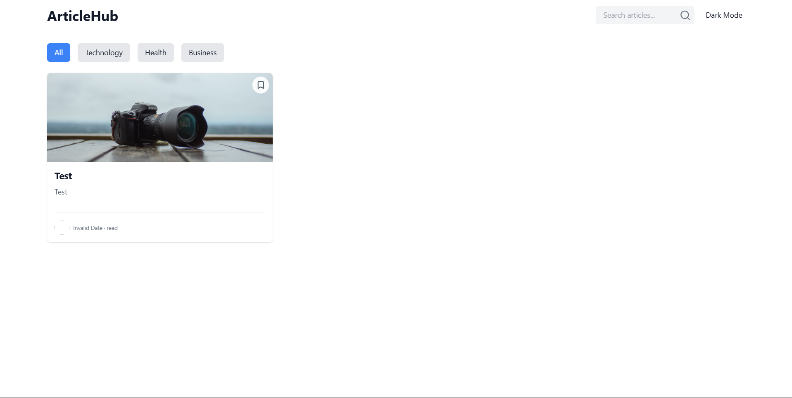
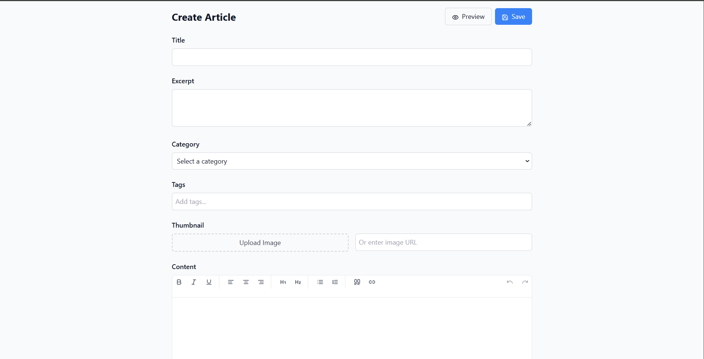

# ArticleHub: Interactive Article Reading Platform

ArticleHub is a modern React-based platform for reading and managing articles. It focuses on providing a clean user interface, smooth user interactions, and efficient state management for an enhanced reading experience.

## Table of Contents
1. [Project Overview](#project-overview)
2. [Features](#features)
3. [Technologies Used](#technologies-used)
4. [Setup Instructions](#setup-instructions)
5. [Component Documentation](#component-documentation)
6. [Known Limitations](#known-limitations)
7. [Future Improvements](#future-improvements)

---

## Project Overview
ArticleHub is designed to:
- Provide a distraction-free reading environment.
- Showcase proper React patterns, state management, and component architecture.
- Enable content creation and management with features like article creation, editing, and bookmarking.

## Features
- **Article List View**: Grid layout, search, and category-based filtering.
- **Reading Experience**: Adjustable font size, reading time, and progress indicator.
- **Content Management**: Article creation with rich text editor, category/tag selection, and thumbnail upload.
- **Interactive Features**: Bookmarking system and sharing functionality.




## Technologies Used
- React (latest stable version)
- React Router for navigation
- CSS Modules or styled-components for styling
- Local storage for data persistence
- Tiptap for rich text editor

## Setup Instructions
1. Clone the repository:
    ```bash
    https://github.com/himanshuKr7/Articlehub.git
    cd articlehub
    ```

2. Install dependencies:
    ```bash
    npm install
    ```

3. Start the development server:
    ```bash
    npm run dev
    ```

4. Open `http://localhost:5173` in your browser.

## Component Documentation
- **HomePage**: Displays a list of articles with title, excerpt, reading time, and thumbnail.
- **ArticleView**: A detailed view of a single article with reading progress and "Last edited" timestamp.
- **CreateArticle**: A form with inputs for title, excerpt, category, tags, thumbnail, and content.
- **BookmarkingSystem**: Allows users to add and remove bookmarks, storing them in localStorage.
- **RichTextEditor**: A customizable editor to create and edit article content.

## Known Limitations
- Search and filter functionality currently only works on the title and excerpt.
- Images and articles are stored in local storage, which may not scale for large amounts of data.

## Future Improvements
- Implement backend API for persistent data storage.
- Add article commenting and user interactions.
- Enhance performance with lazy loading for additional content.
- Improve accessibility for screen readers and keyboard navigation.
